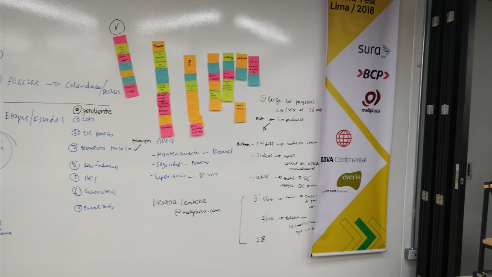
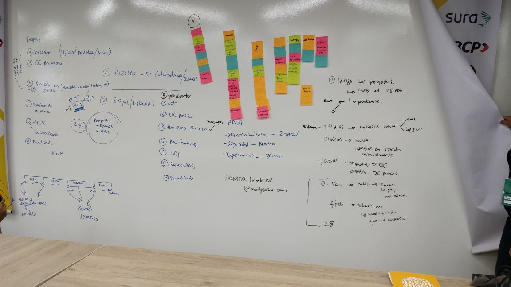
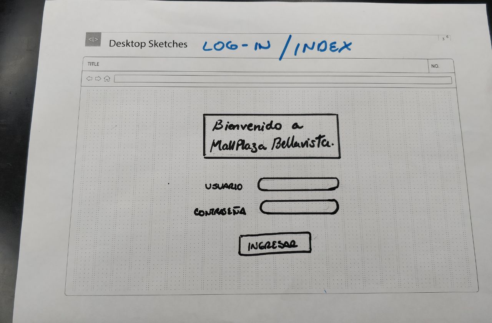
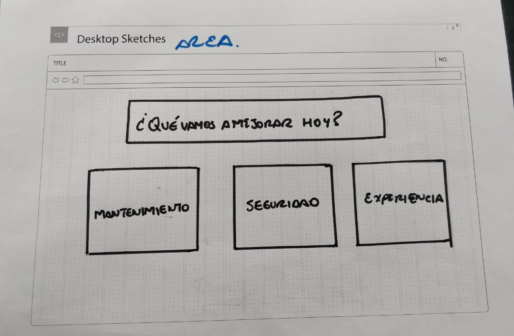
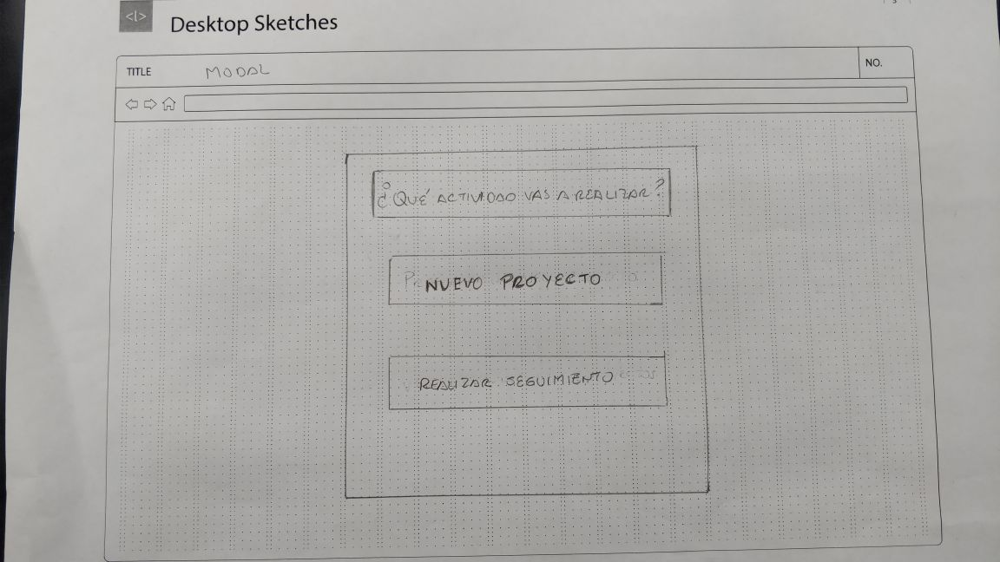
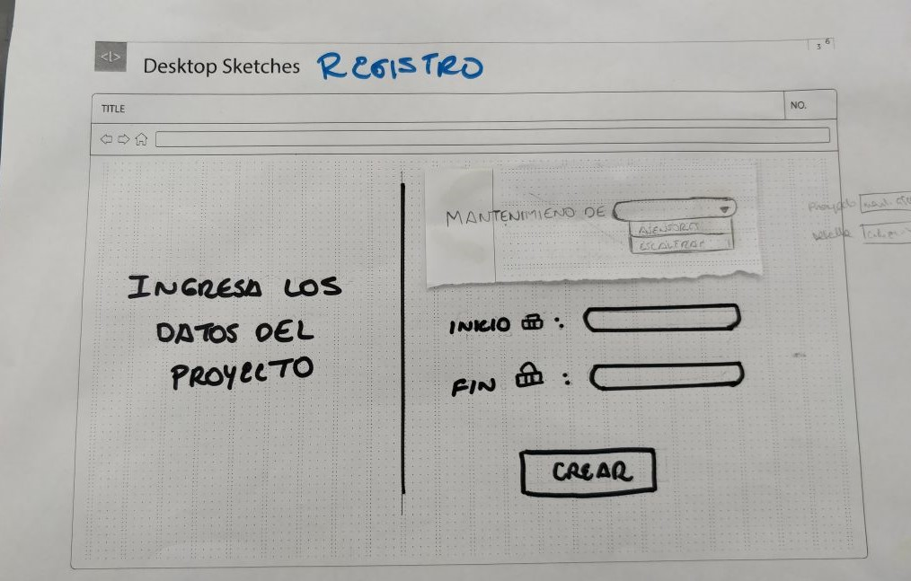
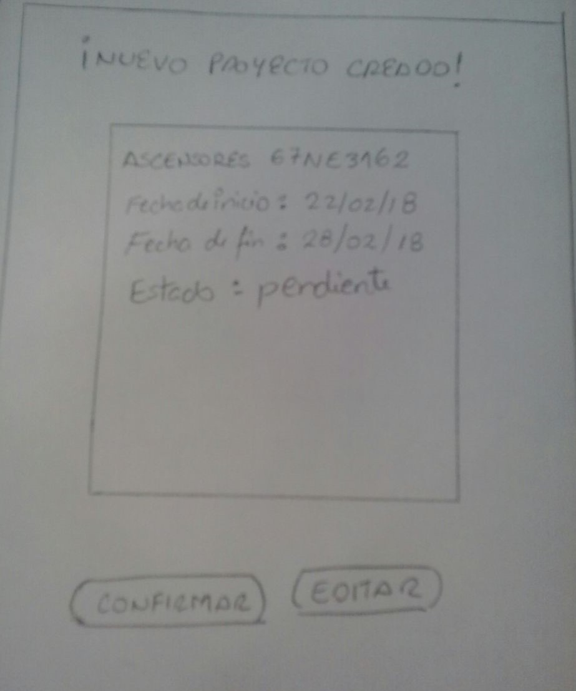
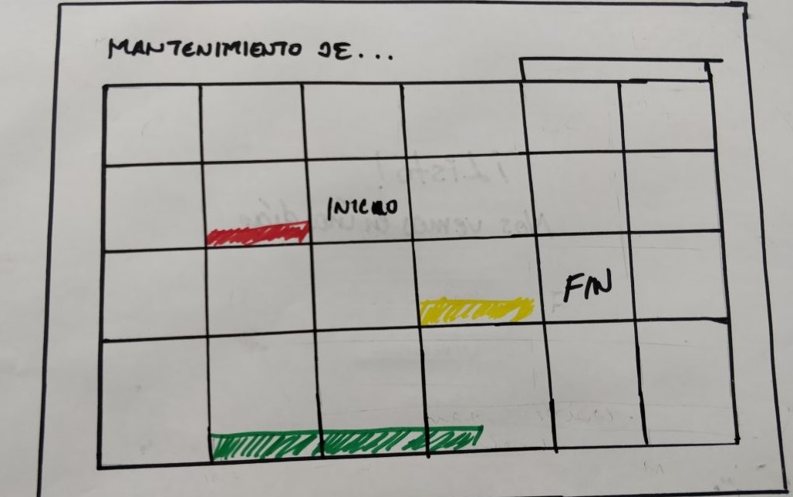
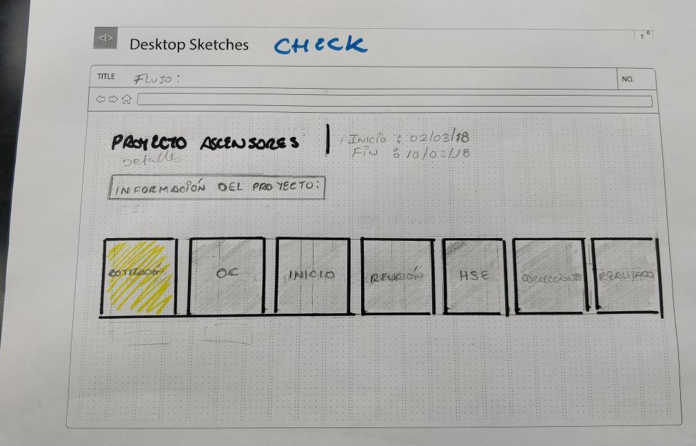

# Plataforma de gestión de proyectos del Centro Comercial Mall Plaza.

La plataforma de gestión de proyectos del área de Mantenimiento del Centro Comercial Mall Plaza Bellavista, permite mantener un seguimiento de los proyectos y tareas pendientes a través de un sistema de notificaciones por correo electrónico. 

## Desarrollado para

[Laboratoria](http://laboratoria.la)

##  Equipo de trabajo:

+ Rodriguez, Lidia
+ Centeno, Carla
+ Chimioque, Andrea
+ Mamani Flores,Gabriela
+ Cisneros Torre, Yelitza

## Descripción del reto:

Gestionar el plan anual de mantenimiento del centro comercial Mall Plaza Bellavista, implementando la información del excel de manera efectiva. Con el fin de crear un sistema práctico y fácil de usar. 

## Objetivo:

Implementar una plataforma que permita al Jefe de Mantenimiento crear proyectos y recibir notificaciones de las tareas a realizar.

## Desarrollo:

- Para la resolución del reto seguimos las etapas de DCU (Diseño Centrado en el Usuario) y las herramientas de Design Thinking. 

### Etapa DCU (Diseño Centrado en el usuario):

### A. Descubrimiento:

**Actividades**

**1.- Entrevista al cliente**

A través de una reunión con Briana encargada del área de Satisfacción del Cliente, obtuvimos los requerimientos y las dificultades que tiene la empresa con el producto actual. 

**2.- Benchmarking**

Se identificaron plataformas online que ofrecen servicios de creación y seguimiento de tareas para empresas. Las principales que se encontraron fueron:

#### Trello:
Permite organizar las tareas en tableros verticales. Las tareas terminadas se pueden archivar para dejar visible sólo lo más importante. Es posible colocar etiquetas o mover las tarjetas a otro tablero para reorganizarlas.

#### Microsoft Project

Se integra con otras aplicaciones de Microsoft y servicios en la nube. Ofrece variedad de plantillas para personalizar cada proyecto en el que estás trabajando, se pueden crear informes y ofrece conversaciones en tiempo real.

#### Asana 
 Mantiene las conversaciones y tareas en un solo lugar. Asana se integra con otras aplicaciones, permite añadir archivos de Dropbox, Box y Google Drive, permite realizar búsquedas y establecer tiempos para cada tarea.

#### Basecamp

Ayuda a establecer diferentes roles, responsabilidades y objetivos para lograr un objetivo común entre tu equipo de trabajo. Tiene un período de prueba gratuito de 60 días.

### B. Síntesis y definición

**Actividades**

**1.- Definición del problema: Diagrama de afinidad y Lluvia de ideas**

Mediante el diagrama de afinidad se identifió diferentes items de acuerdo a los requerimientos para clasificar los problemas a resolver. Los items fueron:

- Proyectos
- Organización
- Interfaz
- Notificaciones
- Inicio de sesión

**2.- Priorización de los items encontrados**

Mediante una lluvia de ideas entre el cliente y el equipo se priorizaron los siguientes requerimientos:

- Calentario de tareas.
- Trazabilidad y seguimientos de las tareas creadas.
- Notificaciones de acuerdo al proceso de ejecución de la empresa.

**3.- Elección del problema**

La ineficiencia y falta de interactividad del excel donde se organizan los proyectos del área de mantenimiento. 

**4.- Definición del user persona**

Se difinició un user persona principal. Es Romei, el jefe de mantenimiento de Mall Plaza. 

Tiene 40 años y lleva tres años trabajando para el centro comercial. Tiene un trabajo muy demandante y cambiante. Atiende diferentes casos y emergencias. 
Debido al ritmo de trabajo que lleva, no siempre puede estar al día con las tareas pendientes de los proyectos y necesita un sistema que le notifique el vencimiento de las tareas.

### C. Prototipado

**Actividades**

**1.- Realización del Content Prototype**

- Realización del content prototype del flujo del MVP. Se intentó replicar la interacción del usuario con la plataforma de registro de proyectos y como se daría el seguimiento. 

[Content Prototyping](https://docs.google.com/document/d/1MSApPLmywamYdcQXC7fnqwvby4jKLMblIh-WRd12Uaw/edit?usp=sharing)

**Testing con el cliente**
 - No es necesario un input para calificar una tarea de prioridad alta o media.
 - Definir mejor el flujo entre la asignación de la tarea y el seguimiento.

 **2.- Paper Prototype**

 Luego del testeo del content prototype, realizó el prototipo del producto en papel definir mejor el flujo y el número de vistas.

**Inicio de sesión**

**Filtro de áreas** 

**Elección de actividad a realizar**

**Registro de datos de la nueva tarea**

**Modal de confirmación de registro**

**Calendario con los proyectos**

**Seguimiento de las tareas**

**Testing con el grupo de trabajo**
- Cambios en los input de llenado de sección de tareas.
- Los botones de selección de actividad en un hover para reducir vistas**

Luego de una iteración y corrección de contenido, se testeo con el cliente.

**Testing con el cliente**
- Cambio en los inputs de registro de tarea. Cambiar por un input de autocompletado y uno manual.
- Cambio de texto de la vista de inicio de sesión y selección de área. 
- Sugerencia de crear una conexión entre el calendario y el seguimiento de tareas.

### D. Iteración y Síntesis:

Luego de una nueva deliberación en el equipo y corrección de errores, se decidió dar prioridad al calendario de tareas y la persistencia de data. Se inició con el maquetado, aplicando el branding de la empresa en el diseño, tipografía y colores. 

### F. Flujo de la aplicación.

**1. Vista: Inicio de sesión**

La primera vista es el inicio de sesión del usuario de Mall Plaza Bellavista, a través de una cuenta de gmail del centro comercial. El inicio de sesión es mediante autenticación de Firebase.

**2. Vista: Selección de Área**

En esta vista el usuario selecciona el área donde crear el proyecto o tarea a realizar. Por medio un hover sobre las opciones, se muestran los botones para crear un nuevo proyecto o ver el calendario de todas las tareas asignadas. El flujo continúa cuando el usuario presiona el botón de "+".

**3. Vista: Registro de proyecto**

Vista que consiste en un formulario donde el usuario selecciona el elemento o servicio donde realizará el proyecto. También debe llenar los campos de inicio y final del proyecto.
Al presionar la opción de "Crear", se redirecciona a la siguiente vista.

**4. Vista: Calendario**

En esta vista, el proyecto creado en el formulario de registro, se muestra en el calendario. Por medio de Zapier se realiza la sincronización entre Google Calendar y Firebase. Al mismo tiempo, el pluggin full Calendar ayuda a visualizar los eventos en el calendario. Firebase se encarga de mostrar tales proyectos en la siguiente vista. 

**5. Vista events**
Se muestran los eventos programados en el calendario en una lista ordenada.

### E. Herramientas utilizadas:

- HTML5
- CSS3
- Materialize.
- Adobe Ilustrator
- plugin Full Calendar
- Firebase
- Javascript.
- jQuery.
- Google Calendar API
- Zapier
